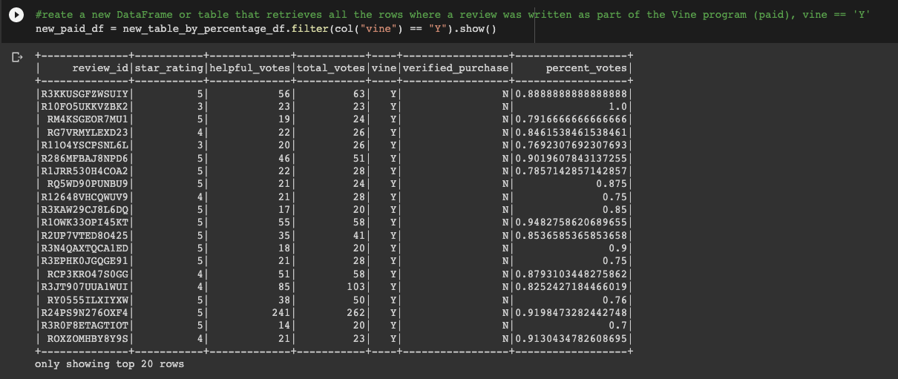

### Amazon_Vine_Analysis

## Overview of the analysis

This was a big data analysis of Amazon reviews with emphasis on those written by paid "Amazon Vine Program". The possible bias between reviews from members of the vine program versus non-members was also investigated. The tools and program used included `Google Colab`, `Pyspark`, `Postgres/pgAdmin`, `AWS RDS`, `Pandas` and `SQL`. Out of 50 datasets, that for videogames category was used for the analysis. Datasets can be found [here](https://s3.amazonaws.com/amazon-reviews-pds/tsv/amazon_reviews_us_Electronics_v1_00.tsv.gz)

An `Extract Transform Load (ETL)` analysis was conducted to retrieve data from amazon s3, transformed usin PySpark in google colab and loaded finaly to MySQL using postgres admin.

## Results: 
The following filtering was done before the results to answer the questions below:

* How many Vine reviews and non-Vine reviews were there?

A total of 94 vine reviews and 40471 non-vine reviews were there.

* How many Vine reviews were 5 stars? How many non-Vine reviews were 5 stars?

A total of 48 vine reviews were 5 stars and 15663 non-vine reviews were 5 stars. 

* What percentage of Vine reviews were 5 stars? What percentage of non-Vine reviews were 5 stars?

A total of 51% vine reviews were 5 stars and 39% non-vine reviews were 5 stars. 

## Summary: 

Given that 0.23% of total reviews comprised of paid vine members with approximates 51% 5_star reviews compared to the non_paid percentage of 39% 5_star reviews, one may conclude there may exist some possible bias by paid vine members. Other product categories can be explored and also exploring the whole data rather than the filtered (percentage of helpful vs. total votes >=50 as we did for this analysis) could yield very usefull insights into the presence of potential bias or not.
